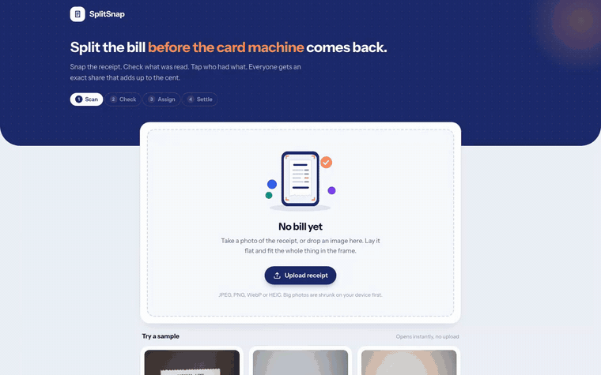
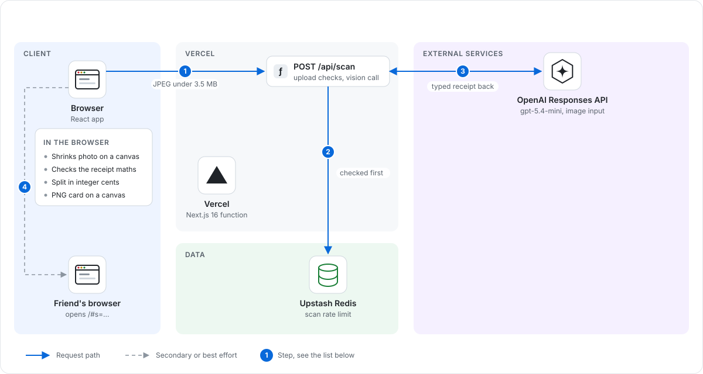
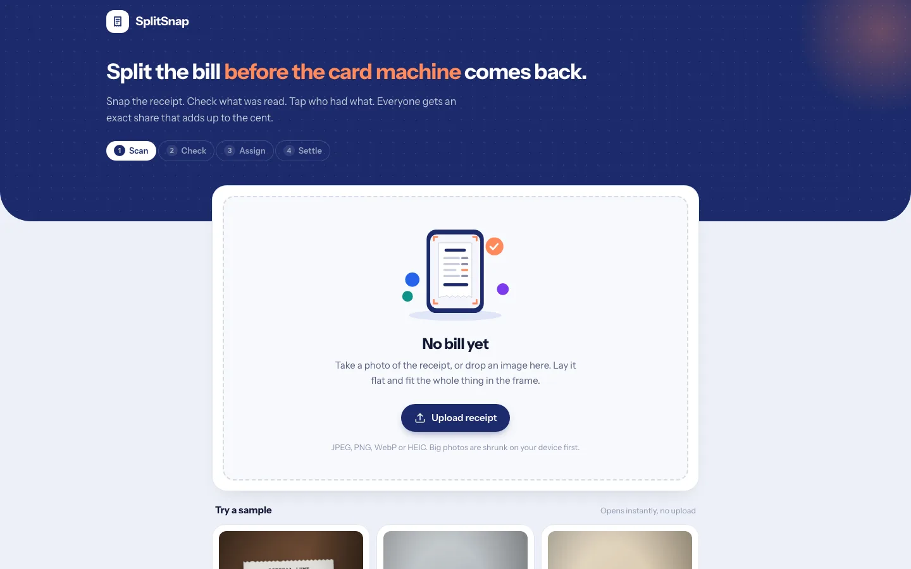
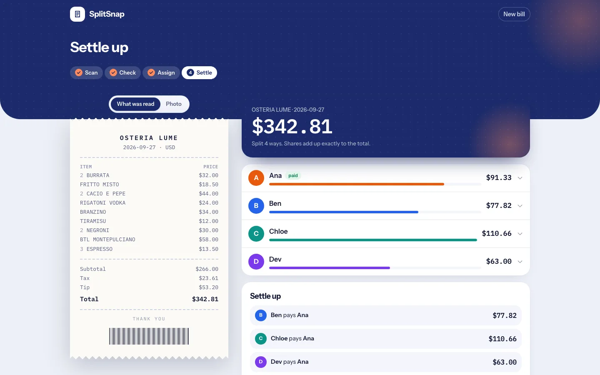

# SplitSnap

Split a restaurant bill from a photo of the receipt, with shares that add up to the cent.

**Live demo:** https://splitsnap-sandy.vercel.app



## Why it exists

Splitting a group bill usually means someone doing receipt maths on a phone calculator while the card machine waits, and the shares rarely add up to the total. SplitSnap reads the receipt from a photo, shows what it read and whether the numbers check out, lets you tap who had what, and sends everyone an exact share. It is built for groups paying at the table.

## How it works

1. **Scan.** The photo is shrunk on the device (2000px long edge, JPEG, under 3.5MB) and posted to `/api/scan`. The route calls the Groq Responses API (OpenAI compatible) with the image as `input_image` and a zod schema through `zodTextFormat`, so Structured Outputs returns typed fields: merchant, date, currency, line items (name, qty, unit price, line total), subtotal, tax, whether tax is already in the prices, tip, service charge, discounts, total and short warnings. The prompt tells the model to transcribe printed numbers as they are and not fix the arithmetic.
2. **Check.** The app does the maths itself (`lib/receipt.ts`). It checks every line (qty x price against the line total, with a small tolerance for rounded unit prices), items against the subtotal, and subtotal plus charges against the total. A confidence banner shows each check, and any line that does not reconcile is highlighted with a one-tap fix. Nothing is hidden: if the receipt still does not add up, the difference is shown and shared out as its own line.
3. **Assign.** Add people, pick one, tap what they had. Tapping several people on one dish splits it evenly. Tax, tip, service and discounts can each be split by what people had or evenly.
4. **Settle.** Per-person totals, who pays whom, and three ways to send it: plain text, a PNG card drawn on a canvas, and a link that carries the whole split in the URL hash (deflate plus base64url). Nothing is stored on a server.

### The money maths

All money is integers in the currency's minor unit (cents, pence, whole yen). Floats only exist at the model boundary, and `toMinor` converts them without drift (1.005 becomes 101). The split in `lib/split.ts` is deterministic:

- A shared dish splits evenly. Leftover cents go to whoever has the lowest running item total, then by the order people were added, so pennies do not pile up on one person.
- Tax, tip, service, discount and any unreconciled difference use the largest remainder method with BigInt arithmetic. Ties go to the earlier person.
- Every component column sums to its receipt amount, and every share sums to the receipt total. A property test checks this on 3,000 random receipts.

### Cost and abuse controls

- One vision call per scan, `detail: "high"`. A real scan of the samples used about 2,350 input and 250 to 300 output tokens with `gpt-5.4-mini`, a fraction of a cent per receipt.
- Samples load a saved result from a real scan, so trying the app costs nothing. A "scan it live" link runs the real call.
- Uploads are checked before anything is counted: content-length cap of 4MB, multipart only, magic-byte sniffing for JPEG, PNG and WebP. Only well-formed requests count against the rate limit.
- Rate limit per IP, 4 scans per hour by default. The window starts at your first counted scan and the 429 response says when it resets. Counts live in a shared Upstash Redis database, so they hold across every serverless instance. Each check is one Lua script that increments and sets the expiry atomically, and a scan over the limit is refused without being counted. If Redis is configured but unreachable, the scan route returns 503 rather than letting the request through. Without the Redis env vars (local dev, tests) it counts in memory. The IP comes from `x-real-ip`, then the last `x-forwarded-for` entry, because the leftmost one is set by the client. Addresses are normalized and IPv6 is grouped by /64, so rotating addresses inside one subscriber's range does not get a fresh limit.
- Groq calls retry once and time out after 25 seconds, so the OpenAI fallback still fits in the function's 60 seconds. OpenAI calls retry 429 and 5xx twice with backoff and time out after 60 seconds. `store: false` asks the provider not to keep receipts.

## Architecture



1. The browser shrinks the photo on a canvas and posts it to `POST /api/scan`.
2. After the upload checks pass, the route counts the scan against the per IP limit in Upstash Redis.
3. The route sends the image to the Responses API with a zod schema and gets a typed receipt back.
4. The browser checks the receipt maths, splits it in integer cents and puts the whole split in the share link's URL hash, so a friend's browser can open it without a server.

**Why it is built this way.** The API key stays on the server and only the scan costs money, so that is the one thing the server does and the one thing it limits. The limit is counted in Redis before the model call, and the split never leaves the browser.

## Screenshots





A 23 second recording of the full sample flow (scan, check, assign, settle) is in [docs/demo.mp4](docs/demo.mp4). Samples load a saved result from a real scan, so the recording made no API call.

## Stack

- Next.js 16 (App Router), React 19, TypeScript, Tailwind CSS 4
- OpenAI Node SDK pointed at Groq: Responses API with image input and Structured Outputs (`qwen/qwen3.8-27b`, falling back to OpenAI `gpt-5.4-mini`)
- zod for the receipt schema
- Integer money maths with BigInt for the largest remainder split, canvas for the share image
- Deployed on Vercel

## Run it

```bash
npm install
cp .env.example .env.local   # add GROQ_API_KEY and/or OPENAI_API_KEY (or vercel env pull .env.local)
npm run dev                  # http://localhost:3203
npm test                     # 70 unit tests: money parsing, reconciliation, split maths, share links, rate limiter, provider fallback
npm run lint && npm run build
```

## Config

| Variable | Default | What it does |
| --- | --- | --- |
| `GROQ_API_KEY` | none | Server-side key for the vision call. When set, Groq reads receipts and OpenAI is only tried once if Groq returns 429, a 5xx or a network error |
| `GROQ_VISION_MODEL` | `qwen/qwen3.8-27b` | Groq model used to read receipts |
| `OPENAI_API_KEY` | none | Fallback key, or the only provider when `GROQ_API_KEY` is empty |
| `OPENAI_MODEL` | `gpt-5.4-mini` | OpenAI model used to read receipts |
| `RATE_LIMIT_SCAN` | `4` | Scans allowed per IP per window |
| `RATE_LIMIT_WINDOW_MS` | `3600000` | Rate limit window, started by the first counted scan |
| `KV_REST_API_URL`, `KV_REST_API_TOKEN` | none | Upstash Redis REST credentials for the shared counters. Set by the Vercel integration; without them counts stay in memory |

## Project layout

- `lib/money.ts` parsing and formatting in minor units
- `lib/receipt.ts` reconciliation and confidence
- `lib/split.ts` allocation, per-person shares, settle up
- `lib/extraction.ts` the Structured Outputs schema, prompt and normalizer
- `lib/share.ts` URL encoding of a split
- `app/api/scan/route.ts` upload checks, rate limit, vision call
- `app/server/ratelimit.ts` and `app/server/redis.ts` per IP limit counted in Upstash Redis, with an in-memory fallback
- `public/samples/` three sample receipt photos (rendered from HTML) and their saved scans

## Related

Other small apps built on the OpenAI API:

- [Interview Coach](https://github.com/Sahilll15/interview-coach): a spoken mock interview with a report that quotes your answers. Live at https://interview-coach-seven-rose.vercel.app
- [Minutes](https://github.com/Sahilll15/minutes): meeting minutes from diarized audio where every item links back to the transcript. Live at https://minutes-sand.vercel.app
- [ShipNotes](https://github.com/Sahilll15/shipnotes): cited release notes from a GitHub compare range. Live at https://shipnotes-mu.vercel.app
- [AskCSV](https://github.com/Sahilll15/askcsv): ask plain English questions about a CSV, answered with checked SQL in the browser
